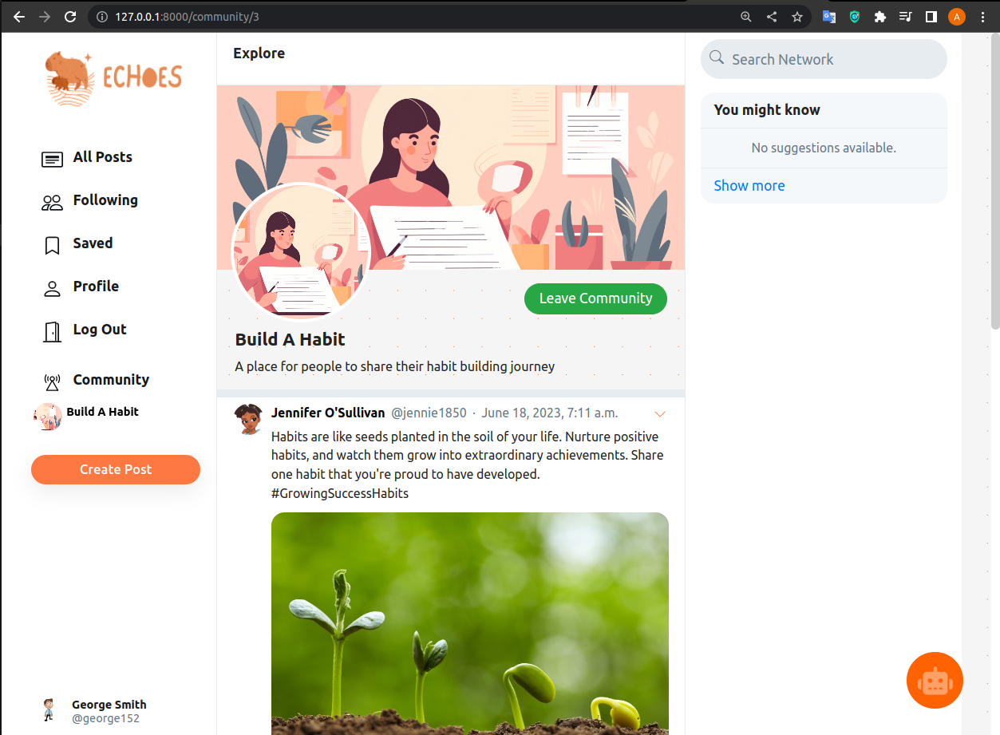

<div align="left">
    <h1>Echoes app</h1>
</div>

<!--  -->


## Table Of Contents
-  [Description](#description)
-  [Features](#features)
-  [Usecase diagram](#usecase-diagram)
-  [Project details](#project-details)
-  [Requirements](#requirements)
-  [Installation](#installation)
-  [Citation](#citation)

## Description   
Echoes is a new social networking site that addresses mental health issues. By utilizing AI to create age-, personality-, and skill-based communities, we reduce social media's harmful effects by personalizing and supporting users.

## Features
- Using chatGPT's API and pretrained NLP models on huggingface such as personalities detection, mental-illness detection, and sentiment analysis.
- Web development using Django and HTML/CSS/Javascript.
- Forming communities based on users' personalities and skills.
- Reducing toxic material and cyberbullying by checking posts and comments.
- Connecting with Mental Health Professionals if needed.

## Usecase diagram


## Project details
- For installation guide, go to this link: https://drive.google.com/file/d/19-3SvGiuWBV1FDuZhGXi4N_4bxc1AMAc/view?usp=sharing
- For demo video, go to this link: https://drive.google.com/file/d/1y4rOoA9je63n6BqlAEhnpeBtxOSyuacq/view?usp=sharing
- For AI pretrain models:
  - Personality detection:[ model 1](https://huggingface.co/spaces/thoucentric/Big-Five-Personality-Traits-Detection)
  - Sentiment Analysis: [ model 2](https://huggingface.co/cardiffnlp/twitter-roberta-base-sentiment)
  - Mental Health Classification: [ model 3](https://huggingface.co/edmundhui/mental_health_trainer)
## Requirements
- Django, transformers, torch, numpy, scipy, Pillow

## Installation
First, clone and set up virtual environment

```bash
# clone project   
git clone https://github.com/linhtran6065/poly2023.git
cd poly2023

# set up virtual env   
python3 -m venv echoes

# activate the env
source echoes/bin/activate  # for Unix/Linux
captionize\Scripts\activate  # for Windows
```   
Second, install dependencies.   

```bash
pip install -r requirements.txt
```  
Next, download the AI models

- Go to the link: https://drive.google.com/file/d/1MtiU-XQxl36Av3kvYmjB1CR4m6vvJ4zH/view?usp=sharing

- Download and move it inside this folder **AI_models/** 

Now run the app
```bash
# run django app
python manage.py runserver
```   

### Citation   
```
@{title={Echoes app},
  year={2023}
}
```   

